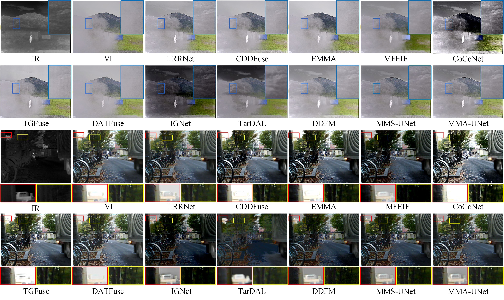
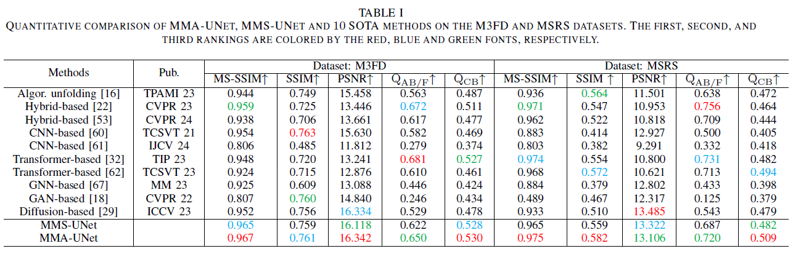

# MMA-UNet
Codes for ***MMA-UNet: A Multi-Modal Asymmetric UNet Architecture for Infrared and Visible Image Fusion. (TETCI 2026)***

-[*[Paper]*](https://ieeexplore.ieee.org/abstract/document/11568563)  
 


## Update
- [2026/8] Release checkpoint for infrared-visible image fusion.


## Citation

```
@article{huang2026mma,
  title={Mma-unet: A multi-modal asymmetric unet architecture for infrared and visible image fusion},
  author={Huang, Jingxue and Li, Xilai and Tan, Tianshu and Li, Xiaosong and Zhou, Fuqiang and Li, Huafeng},
  journal={IEEE Transactions on Emerging Topics in Computational Intelligence},
  year={2026},
  publisher={IEEE}
}
```

## Abstract

Multi-modal image fusion (MMIF) aims to map useful information from various modal into the same representation space, thereby producing informative fused images. However, existing fusion algorithms often overlook the alignment of multi-modal feature space and tend to symmetrically fuse multi-modal images, leading to unreasonable bias towards a single modal in certain regions of the fusion results. In this work, we first revealed the distribution difference between feature space of different modal. To overcome the fusion performance degradation caused by the difference in the fusion process, we designed a guidance mechanism to accelerate the feature extraction speed of infrared images by the network, thereby reducing the feature-space distribution gap between multi-modal feature. Unlike conventional symmetric fusion schemes that rely on layer-wise correspondence between encoders, we propose a Multi-Modal Asymmetric UNet (MMA-UNet), adopting an asymmetric fusion strategy that enables cross-level feature fusion. This design allows modality-specific representations at different semantic depths to be selectively integrated through cross-level feature pairing, thereby ensuring that features from different modalities are fused within a compatible feature space. Extensive multi-modal image fusion on public datasets, as well as the experiments on downstream tasks, consistently demonstrated the proposed MMA-UNet outperforms competitive state-of-the-art methods in both qualitative and quantitative evaluations.

## 🌐 Usage

### ⚙ Network Architecture

Our MMA-UNet is implemented in ``unet/unetv2.py``.


### 🏄 Testing

**1. Pretrained models**

Pretrained models are available in [this link](https://pan.baidu.com/s/1tR5apUe0V_QKJdkmXxEA7w?pwd=QWER) 

**2. Test datasets**

The test datasets used in the paper have been stored in ``'./data/MSRS/ir' and './data/MSRS/vis_gray'``.


## 🙌 MMA-UNet

### Illustration of our MMA-UNet model.

  

### Qualitative fusion results.

  
 
### Quantitative fusion results.

  
 
